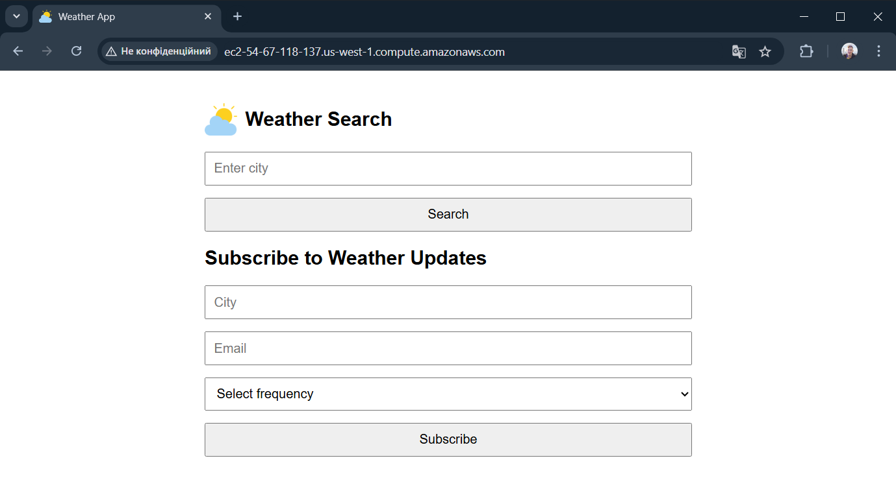
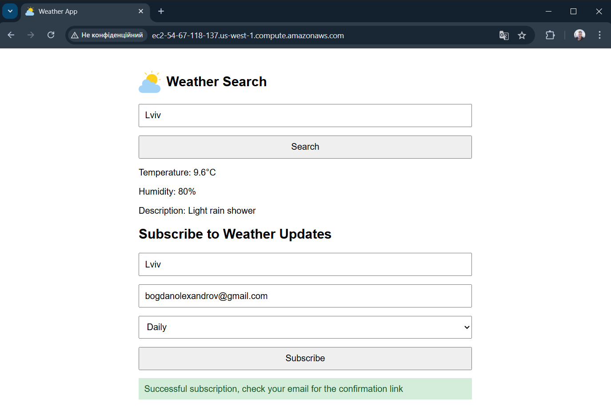
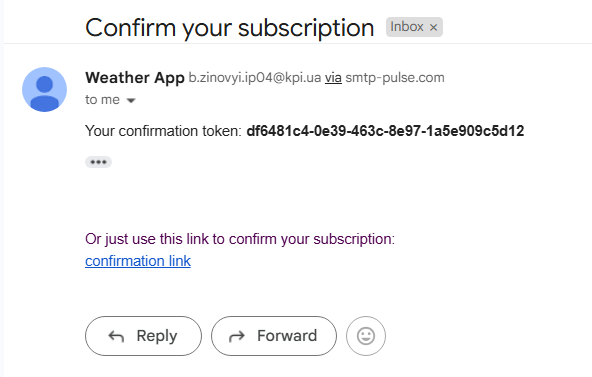
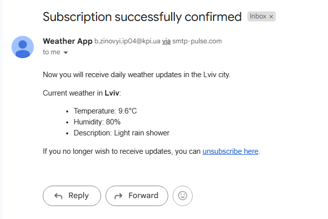
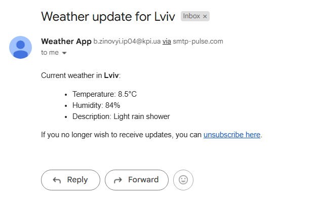
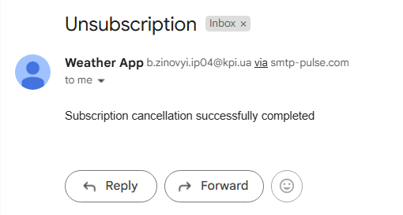

# 🌤️ Сервіс підписки на прогноз погоди

Pастосунок дозволяє користувачам підписатися на отримання регулярного прогнозу погоди на електронну пошту для обраного міста. Підтримується щогодинна або щоденна частота оновлень. Також доступна можливість підтвердити або скасувати підписку використовуючи токен.

---

## Інструкція з розгортання

1. Склонувати репозиторій:

   ```bash
   git clone https://github.com/Bogdan-Zinovij/weather-subscription-service.git
   cd weather-subscription-service
   ```

2. Завантажити `.env` файл з Google Диску та помістити його в кореневу директорію проєкту.  
   👉 [Завантажити `.env`](https://drive.google.com/file/d/1goJ6jrW1zd5qThr0Y0o7xgsQysHiN6I7/view?usp=sharing)

3. Запустити додаток за допомогою Docker Compose:

   ```bash
   docker compose up
   ```

   Додаток буде доступний локально на 3000 порті.
   URL приклад запиту:
   http://localhost:3000/weather?city=Kyiv

   - _Примітка_1_: серед логів при піднятті сервісу будуть виводитися і логи запуску міграцій таблиць Tokens, Subscriptions та додавання зв'язку між ними. (Файли міграцій знаходяться в /src/database/migrations)
   - _Примітка_2_: існуючі контракти апі, що були описані в документації, не змінювалися. Деякі відповіді апі були розширені повідомленням тексту помилки

---

## Деплой

Застосунок задеплоєно на AWS EC2. Тут розміщено апі та html-сторінка для підписки за посиланням:
🔗 [http://ec2-54-67-118-137.us-west-1.compute.amazonaws.com](http://ec2-54-67-118-137.us-west-1.compute.amazonaws.com)

---

## Використані технології та сервіси

Технології:

- **NestJS** — фреймворк з модульною архітектурою для Node.js
- **TypeScript** — як основна мова програмування зі строгою типізацією
- **PostgreSQL** — реляційна база даних для збереження даних додатку
- **TypeORM** — ORM для спрощеної роботи з базою даних
- **Docker / Docker Compose** — для контейнеризації та локального запуску
- **@nestjs-modules/mailer** — для надсилання email повідомлень
- **AWS EC2** — хостинг додатку

Сторонні сервіси:

- **WeatherAPI.com** — зовнішнє джерело даних про погоду
- **SendPulse.com** — SMTP сервер для надсилання email-повідомлень

---

## Архітектура

Застосунок побудований на принципах **Clean Architecture**, що забезпечує масштабованість, зручність тестування та чисту бізнес-логіку.

- **Доменні моделі** (`Subscription`, `Weather`) ізольовані від інфраструктурної реалізації. Вони використовуються виключно в бізнес-логіці.
- **Мапінг** між доменними моделями та ORM-ентіті в репозиторіях (`SubscriptionEntity`, `TokenEntity`) реалізовано окремо, щоб не змішувати бізнес-логіку з технічними деталями БД. В сервісі всі операції виконуються лише з доменними моделями.
- **Інтерфейси репозиторіїв** описують поведінку доступу до даних, а конкретна реалізація (на базі TypeORM) інкапсульована всередині інфраструктурного шару.
- Код поділений на шари:
  - `application` — бізнес-логіка, сервіси
  - `infrastructure` — доступ до БД (ентіті, репозиторії), сторонні API
  - `interfaces` — контролери, вхідні/вихідні порти
- Модульність - в основі кожного модуля інкапсулюється окрема доменна модель (або окремий сервіс) та пов'язана з нею логіка. Спільні константи та інтерфейси винесені в папку `common`.

---

## Взаємодія модулів

- Користувач відправляє **POST /subscribe** з email, містом та періодом оновлень.

  - `SubscriptionService` створює підписку, викликаючи репозиторій та `TokenService` для генерації токена.
  - Email з токеном надсилається через `MailerService`.

- Користувач переходить по **GET /confirm/{token}**:

  - `TokenService` перевіряє валідність токена, підписка підтверджується.

- Через **GET /unsubscribe/{token}** — аналогічно, відбувається відписка.

- Після кожного успішного запиту в ендпоінті `/subscription` викликається `MailService` для надсилання повідомлення для підтвердження підписки, про успішне оформлення підписки, оновлення погоди та скасування підписки.

- Кожну годину або кожен день опівдні запускаються **cron-задачі**, які:

  - Отримують всі підтверджені підписки з необхідною частотою
  - Для кожного унікального міста з підписок кешують погоду з WeatherAPI.com
  - Розсилають прогнози по email через SMTP сервер

---

## Демонстрація алгоритму проходження всіх успішних кейсів додатку

- HTML сторінка додатку роздається як статика, знаходиться за маршрутом `/`:



- На сторінці можна переглянути погоду для міста та підписатися на розсилку. Після підписки на розсилку з'являється текст з вказівкою переглянути поштову скриньку:



- На пошту приходить лист з токеном для підтвердження реєстрації. Можна скористатися посиланням, яке відправляє GET запит на `/subscriptions/confirm/${token}`.



- Після цього на пошту приходить лист про успішне підтвердження підписки та поточною погодою у підписаному місті



- Далі, в залежності від вибраної періодичності раз в годину о хх:00 або ж раз на добу о 12:00 AM будуть приходити повідомлення зі станом погоди, якщо підписка підтверджена.



- У кожному повідомленні з оновленням погоди прикріплюється лінк, що відправляє GET запит на `/subscriptions/confirm/${token}`, яким можна скористатися щоб скасувати підписку. Для цього використовується той самий токен, що був надісланий користувачу під час його реєстрації



- Після скасування підписки, об'єкт підписки та токена видаляється з бази даних, і користувач знову може оформити нову підписку. Невалідні запити або неуспішні кейси повертають статус помилки згідно документації, а також повідомлення про тип помилки.

---
