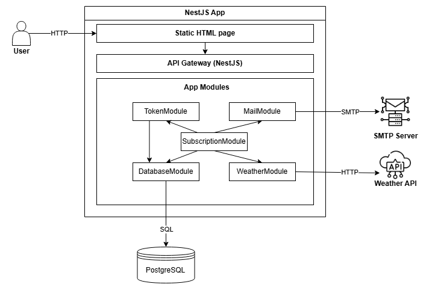

# 1. Вступ та огляд

## Призначення

Сервіс дозволяє користувачам підписатися на отримання погодних сповіщень на email для конкретного міста з обраною частотою (hourly, daily). Додаток автоматично надсилає погодні оновлення відповідно до підписки.

## Контекст

Сервіс обробляє підписку, підтвердження, відписку та розсилку погоди.
Обмеження:

- Немає авторизації (public API)
- Немає збереження історії погодних даних

## Переваги

- Автоматична розсилка без потреби в додатку
- Просте REST API
- Розширюваність через Clean Architecture

---

# 2. Функціональні вимоги

## API Endpoints

- `POST /subscription/subscribe` — створити підписку
- `GET /subscription/confirm/{token}` — підтвердити підписку
- `GET /subscription/unsubscribe/{token}` — скасувати підписку
- `GET /weather?city={city}` — отримати поточну погоду

## Модель даних

### Subscription Request:

```json
{
  "email": "user@example.com",
  "city": "Kyiv",
  "frequency": "hourly"
}
```

### Weather Response:

```json
{
  "temperature": 20.5,
  "humidity": 60,
  "description": "Cloudy"
}
```

## Use-cases використання API

- Підписка: перевірка дубліката підписки -> створення -> надсилання email для підтвердження
- Підтвердження: знайти токен підтвердження -> оновити статус підписки на підтверджений -> надсилання email про успішне підтвердження
- Відписка: знайти токен -> видалити підписку та токен -> надсилання email про успішну відписку
- Розсилка погоди: з обраною періодичністю запит погоди до API / кешу -> надсилання email розсилки всім підтвердженим підпискам

---

# 3. Нефункціональні вимоги

## Продуктивність

- `/weather` відповідає до 300 мс

## Масштабованість

- Підтримка 50k+ підписок завдяки CRON-розсилці та кешу погоди
- Кешування погоди для унікальних міст обмежує зовнішні запити

## Безпека

- Валідація вхідних даних через `class-validator`
- Верифікація UUID токенів
- Відсутність авторизації (публічні маршрути)

## Обробка помилок

- 400 Bad Request — невалідний запит або токен
- 404 Not Found — підписка/токен не знайдені
- 409 Conflict — дубльована підписка

---

# 4. Архітектура системи

## Схема компонентів системи



## Стек технологій

- NestJS (TypeScript)
- PostgreSQL + TypeORM
- Docker + Docker Compose
- SMTP: SendPulse
- Weather API: weatherapi.com

## Патерни проектування

- Clean Architecture
- Dependency Injection
- Repository pattern
- Separation of concerns

---

# 5. Обрані технології та обгрунтування

### NestJS (Node.js + TypeScript)

- **Причина вибору**: Вбудована підтримка модульності, Dependency Injection, Pipes, Middleware, Guards. Дає змогу легко реалізувати Clean Architecture, окремі модулі та шари.
- **Альтернатива**: ExpressJS, Fastify.
- **Чому відмовились**:
  - Express — потребує багато ручної структури, слабка підтримка DI.
  - Fastify — швидший, але уставлена екосистема NestJS підходить краще.

### TypeORM + PostgreSQL

- **Причина вибору**: підтримка migrations, entity-based моделювання.
- **Альтернатива**: Prisma, MongoDB.
- **Чому відмовились**:
  - Prisma — менш гнучка у кастомізації.
  - MongoDB — не підходить, бо реляційна схема бд.

### WeatherAPI.com

- **Причина вибору**: безкоштовний тариф, зрозуміле REST API, мінімум налаштувань.
- **Альтернатива**: OpenWeatherMap.
- **Чому відмовились**:
  - OpenWeatherMap — складніший інтерфейс, менше безкоштовних запитів.

### @nestjs-modules/mailer + SMTP (SendPulse)

- **Причина вибору**: просте підключення SMTP, повна інтеграція в NestJS, можливість задавати шаблони листів.
- **Альтернатива**: nodemailer напряму, SendGrid API.
- **Чому відмовились**:
  - Nodemailer потребує ручного налаштування, немає DI-модуля.
  - SendGrid вимагає додаткових SDK/API ключів, платний тариф.

### Docker + Docker Compose

- **Причина вибору**: швидкий старт, можливість запускати всі сервіси локально та в продакшені з однаковими налаштуваннями.
- **Альтернатива**: k8s.
- **Чому відмовились**:
  - k8s — складніше налаштувати + це не потрібно для MVP.

---

# 6. Компоненти системи

### 1. `WeatherModule`

- **Призначення**: отримання актуальних погодних даних через зовнішній API.
- **Склад**: `WeatherService`, `WeatherController`.
- **Взаємодія**: викликається з `SubscriptionService` для отримання погодних даних під час CRON-розсилок та через `/weather`.

---

### 2. `SubscriptionModule`

- **Призначення**: управління підписками - створення, підтвердження, видалення, розсилка.
- **Склад**:
  - `SubscriptionService` — бізнес-логіка.
  - `SubscriptionController` — API маршрути.
  - `SubscriptionCronService` — CRON-розсилка.
  - `TypeOrmSubscriptionRepository` — реалізація доступу до БД.
  - `SubscriptionEntity` — ORM-таблиця.
- **Взаємодія**:
  - Залежить від `TokenService`, `WeatherService`, `MailService`.
  - Кожну годину/день формує email з прогнозом погоди.

---

### 3. `TokenModule`

- **Призначення**: створення та управління токенами для підтвердження та скасування підписки.
- **Склад**:
  - `TokenService`
  - `TypeOrmTokenRepository`
  - `TokenEntity`
- **Взаємодія**: використовується під час створення, підтвердження та видалення підписки у модулі підписок.

---

### 4. `MailModule`

- **Призначення**: надсилання email листів.
- **Склад**: `MailService`, конфігурація SMTP, шаблони в `mail.templates.ts`.
- **Взаємодія**:
  - `SubscriptionService` надсилає підтвердження, відписку та оновлення через `MailService`.

---

### 5. `DatabaseModule`

- **Призначення**: централізоване налаштування підключення до бази даних.
- **Взаємодія**: використовується модулями Subscription, Token.

---

### 6. CRON Jobs

- **Реалізація**: клас `SubscriptionCronService` в `SubscriptionModule`
- **Призначення**: періодична відправка листів залежно від частоти підписки
- **Використовує**: метод `.sendWeatherToSubscribers(frequency)` у сервісі підписок

---

# 7. Структура бази даних

Сутності бази даних та зв'язки між ними створюються через міграції. Перелік таблиць:

### Таблиця: `tokens`

| Назва поля | Тип     | Опис                               |
| ---------- | ------- | ---------------------------------- |
| id         | UUID    | Первинний ключ                     |
| value      | VARCHAR | UUID токен, використовується в URL |

---

### Таблиця: `subscriptions`

| Назва поля | Тип                      | Опис                                              |
| ---------- | ------------------------ | ------------------------------------------------- |
| id         | UUID                     | Первинний ключ                                    |
| email      | VARCHAR                  | Email користувача                                 |
| city       | VARCHAR                  | Назва міста                                       |
| frequency  | ENUM ('hourly', 'daily') | Частота розсилки                                  |
| confirmed  | BOOLEAN                  | `false` при створенні, `true` після підтвердження |
| tokenId    | UUID (FK -> tokens.id)   | Посилання на токен, 1:1 зв’язок                   |

### Зв'язок:

- `tokens` має зв'язок 1:1 з `subscriptions` через поле `tokenId`

---

# 8. Взаємодія компонентів

### `SubscriptionController`

- Приймає HTTP-запити на `/subscribe`, `/confirm/:token`, `/unsubscribe/:token`
- Делегує всі дії в `SubscriptionService`

### `SubscriptionService`

- Створює токен через `TokenService`
- Зберігає підписку через `SubscriptionRepository`
- Надсилає листи через `MailService`
- Отримує погоду через `WeatherService`
- Запускає CRON-задачі для періодичних email-розсилок

### `WeatherService`

- Отримує поточну погоду через `HttpService`
- Мапить відповіді з `weatherapi.com` у доменну модель `Weather`
- Повертає температуру, вологість, опис

### `MailService`

- Відправляє email на основі шаблонів підтвердження підписки, оновлення погоди або повідомлення про відписку

### `TokenService`

- Генерує UUID токени
- Шукає токени по `id` або `value`
- Видаляє токени при відписці

# 9. Контракти АПІ

## 1. POST /subscription/subscribe

**Description:** Створення нової підписки на оновлення погоди.

### Request

```
POST /subscription/subscribe
Content-Type: application/json

{
  "email": "user@example.com",
  "city": "Lviv",
  "frequency": "hourly"
}
```

### Validation

- `email`: валідний email
- `city`: непорожній рядок, до 100 символів
- `frequency`: одне з `hourly` або `daily`

### Responses

#### 200 OK

```json
{}
```

#### 409 Conflict

```json
{
  "statusCode": 409,
  "message": "Email already subscribed"
}
```

#### 400 Bad Request

```json
{
  "statusCode": 400,
  "message": "Invalid input"
}
```

---

## 2. GET /subscription/confirm/{token}

**Description:** Підтвердження створеної підписки.

### Path Parameter

- `token`: UUID

### Responses

#### 200 OK

```json
{}
```

#### 404 Not Found

```json
{
  "statusCode": 404,
  "message": "Token not found"
}
```

#### 400 Bad Request

```json
{
  "statusCode": 400,
  "message": "Invalid token"
}
```

---

## 3. GET /subscription/unsubscribe/{token}

**Description:** Скасування підписки за токеном.

### Path Parameter

- `token`: UUID

### Responses

#### 200 OK

```json
{}
```

#### 404 Not Found

```json
{
  "statusCode": 404,
  "message": "Token not found"
}
```

#### 400 Bad Request

```json
{
  "statusCode": 400,
  "message": "Invalid token"
}
```

---

## 4. GET /weather

**Description:** Отримання поточної погоди для обраного міста.

### Query Parameters

- `city`: string

### Responses

#### 200 OK

```json
{
  "temperature": 22.5,
  "humidity": 60,
  "description": "Partly cloudy"
}
```

#### 400 Bad Request

```json
{
  "statusCode": 400,
  "message": "City required"
}
```

#### 404 Not Found

```json
{
  "statusCode": 404,
  "message": "City not found"
}
```

---

# 10. Перевірка функціональності

#### 1. Юніт-тести

- Тестування сервісів `SubscriptionService` і `WeatherService`
- Моки: `WeatherRepository`, `SubscriptionRepository`, `MailerService`, `HttpService`
- Покривається логіка:

  - успішні кейси виконання;
  - генерація токену;
  - відмова при дублюванні підписки;
  - надсилання листів.

#### 2. Інтеграційні тести (ручні)

- Всі API тестуються через Postman:

  - `POST /subscription/subscribe` — очікується 200 або 409;
  - `GET /subscription/confirm/:token` — підтвердження в БД;
  - `GET /subscription/unsubscribe/:token` — запис видаляється;
  - `GET /weather?city=Lviv` — отримується кешована або нова погода.

#### 3. Swagger UI

- Всі маршрути підняті з документацією `@nestjs/swagger`
- У Swagger можна перевірити валідацію DTO, помилки 400, 409, 404

---

# 11. Можливі покращення

## 1. Використання Redis для кешування погоди

Спочатку кешування реалізовано як колекція Map() у коді сервісу підписок. Цей варіант є неоптимальним, так як нагромаджується пам'ять додатку, колекція не очищується та після перезапуску інстансу сервера всі кешовані запити зникнуть. Кешування погоди в Redis з TTL 1 година дозволить:

- зменшити кількість запитів до WeatherAPI
- уникнути перевищення ліміту API (1000 запитів/хв)
- забезпечити надійність збереження кешу при падінні інстансу сервера

## 2. Додавання Load Balancer для масштабування

У разі росту трафіку, доцільно буде використати балансувальник навантаження (NGINX або AWS ALB). Переваги:

- можна розподілити навантаження на кілька інстансів
- покращиться fault tolerance
- буде зменшено час відповіді при пікових навантаженнях

## 3. Перенесення email-розсилок у чергу через BullMQ або RabbitMQ

На ранньому етапі прокту email надсилаються синхронно, що затримує відповіді. Використання черги дозволить:

- розділити процес формування відповіді API та відправку листа
- масштабувати email-воркери окремо від основного додатку
- зменшить ризик помилок під час розсилки

---

## Рев’ю

- [x] Богдан Зіновий
- [ ] Микола
- [ ] Богдан
- [ ] Іван

---

## Дедлайн

Дедлайн для узгодження та фіналізації дизайн-документа: 10:00 09/06/2025
