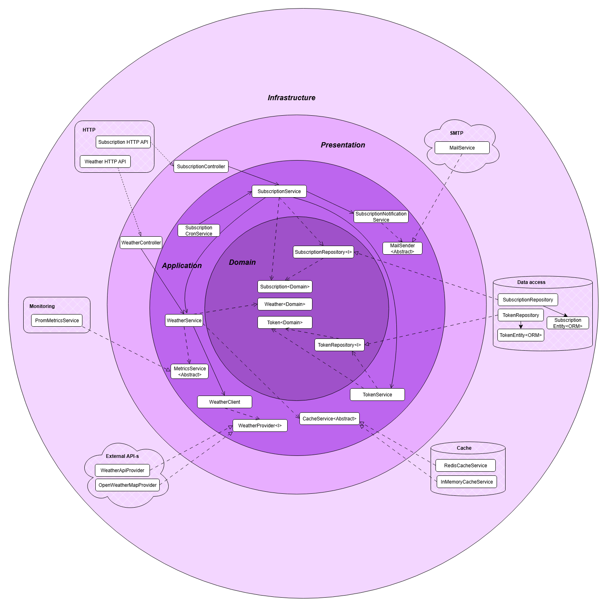

# 1. Introduction and Overview


## Purpose


The service allows users to subscribe to receive weather notifications via email for a specific city with a chosen frequency (hourly, daily). The application automatically sends weather updates according to the subscription.


## Context


The service handles subscription, confirmation, unsubscription, and weather distribution.
Limitations:


- No authorization (public API)
- No storage of weather data history


## Benefits


- Automatic distribution without the need for an application
- Simple REST API
- Extensibility through Clean Architecture


---


# 2. Functional Requirements


## API Endpoints


- `POST /subscription/subscribe` — create a subscription
- `GET /subscription/confirm/{token}` — confirm subscription
- `GET /subscription/unsubscribe/{token}` — cancel subscription
- `GET /weather?city={city}` — get current weather


## Data Model


### Subscription Request:


```json
{
  "email": "user@example.com",
  "city": "Kyiv",
  "frequency": "hourly"
}
```


### Weather Response:


```json
{
  "temperature": 20.5,
  "humidity": 60,
  "description": "Cloudy"
}
```


## API Use Cases


- Subscription: check for duplicate subscription -> creation -> send email for confirmation
- Confirmation: find confirmation token -> update subscription status to confirmed -> send email about successful confirmation
- Unsubscription: find token -> delete subscription and token -> send email about successful unsubscription
- Weather Distribution: at the chosen frequency, request weather from API / cache -> send email distribution to all confirmed subscriptions


---

# 3. Non-functional Requirements

## Performance

- `/weather` responds within 300 ms

## Scalability

- Supports 50k+ subscriptions through CRON dispatch and weather caching
- Weather caching for unique cities limits external requests

## Security

- Input data validation via `class-validator`
- Token UUID verification
- No authorization (public routes)

## Error Handling

- 400 Bad Request - invalid request or token
- 404 Not Found - subscription/token not found
- 409 Conflict - duplicate subscription

---

# 4. System Architecture

## System Architecture Diagram



## Technology Stack

- NestJS (TypeScript)
- PostgreSQL + TypeORM
- Docker + Docker Compose
- SMTP: SendPulse
- Weather API: weatherapi.com

## Design Patterns

- Clean Architecture
- Dependency Injection
- Repository pattern
- Separation of concerns
- Chain of Responsibility

---

# 5. Chosen Technologies and Justification

  - Prisma — less flexible in customization.
  - MongoDB — not suitable due to relational database schema.


### WeatherAPI.com and OpenWeatherMap


- **Reason for choice**: free tier, intuitive REST API, minimal configuration, popularity


### @nestjs-modules/mailer + SMTP (SendPulse)


- **Reason for choice**: simple SMTP connection, full integration into NestJS, ability to define email templates.
- **Alternative**: nodemailer directly, SendGrid API.
- **Why rejected**:
  - Nodemailer requires manual configuration, no DI module.
  - SendGrid requires additional SDK/API keys, paid tier.


### Docker + Docker Compose


- **Reason for choice**: quick start, ability to run all services locally and in production with the same configuration.
- **Alternative**: k8s.
- **Why rejected**:
  - k8s — more complex to configure + not needed for MVP.


### Redis


- **Reason for choice**: fast in-memory caching with TTL, key-value support, suitable for caching weather data.
- **Alternative**: in-memory cache manually, Memcached.
- **Why rejected**:
  - Memcached — does not support complex structures and TTL at the record level.
  - In-memory — lost after restart, not suitable for distributed environments. Used in unit tests to avoid starting Redis.


### Prometheus


- **Reason for choice**: convenient collection of metrics from NestJS application, observability tools.
- **Alternative**: StatsD.
- **Why rejected**:
  - Requires an intermediate server.


---


# 6. System Components


### 1. `WeatherModule`


- **Purpose**: obtaining current weather data through an external API.
- **Components**:
  - `WeatherService` — main logic for weather retrieval, caching, metrics.
  - `WeatherController` — HTTP API.
  - `WeatherClient` — delegates the request to a chain of providers.
  - `WeatherProviderChain` — fallback mechanism between multiple providers.
  - `OpenWeatherMapProvider`, `WeatherApiProvider` — separate implementations for obtaining weather.
- **Interaction**:
  - Called by `SubscriptionService` for sending out notifications.
  - Caches responses in Redis.
  - Records hit/miss metrics.


---

### 2. `SubscriptionModule`

  - `TokenService`
  - `TypeOrmTokenRepository`
  - `TokenEntity`
- **Interaction**: used during subscription creation, confirmation, and deletion in the subscriptions module.


---


### 4. `MailModule`


- **Purpose**: sending emails.
- **Components**: `MailService`, SMTP configuration, templates in `mail.templates.ts`.
- **Interaction**:
  - `SubscriptionService` sends confirmations, unsubscriptions, and updates via `MailService`.


---


### 5. `DatabaseModule`


- **Purpose**: centralized database connection setup.
- **Interaction**: used by Subscription, Token modules.


---


### 6. CRON Jobs


- **Implementation**: `SubscriptionCronService` class in `SubscriptionModule`
- **Purpose**: periodic sending of emails based on subscription frequency
- **Uses**: `.sendWeatherToSubscribers(frequency)` method in the subscriptions service


---


### 7. `CacheModule`


- **Purpose**: caching weather data (and potentially other data in the future).
- **Components**:
  - `CacheService` — abstract caching interface.
  - `RedisCacheService` — main production implementation.
  - `InMemoryCacheService` — uses an in-memory Map, applied in unit tests.
- **Interaction**:
  - `WeatherService` uses it to reduce load on external APIs.


---


### 8. `MetricsModule`


- **Purpose**: exporting metrics to Prometheus.
- **Components**:
  - `MetricsService` — incrementing metrics (`weather_cache_hit`, `weather_cache_miss`).
- **Interaction**:
  - Used in `WeatherService` to log cache statistics.


---

# 7. Database Structure

Database entities and their relationships are created through migrations. Table listing:

### Table: `tokens`

| Field Name | Type    | Description                   |
| ---------- | ------- | ----------------------------- |
| id         | UUID    | Primary key                   |
| value      | VARCHAR | UUID token, used in URL       |

---

### Table: `subscriptions`

| Field Name | Type                      | Description                                   |
| ---------- | ------------------------ | --------------------------------------------- |
| id         | UUID                     | Primary key                                   |
| email      | VARCHAR                  | User's email                                  |
| city       | VARCHAR                  | City name                                     |
| frequency  | ENUM ('hourly', 'daily') | Mailing frequency                             |
| confirmed  | BOOLEAN                  | `false` on creation, `true` after confirmation |
| tokenId    | UUID (FK -> tokens.id)   | Reference to the token, 1:1 relationship       |

### Relationship:
- `tokens` has a 1:1 relationship with `subscriptions` through the `tokenId` field.


---


# 8. Component Interaction


### `SubscriptionController`


- Accepts HTTP requests to `/subscribe`, `/confirm/:token`, `/unsubscribe/:token`
- Delegates all actions to `SubscriptionService`


### `SubscriptionService`


- Creates a token via `TokenService`
- Saves the subscription via `SubscriptionRepository`
- Sends emails via `MailService`
- Retrieves weather via `WeatherService`
- Starts CRON jobs for periodic email newsletters


### `WeatherService`


- Retrieves weather via `WeatherClient`, which implements the **Chain of Responsibility** pattern
- Caches data in Redis via `CacheService`
- Increments metrics (`cache_hit`, `cache_miss`) via `MetricsService` (Prometheus)
- Interacts with providers (`OpenWeatherMap`, `WeatherAPI`) via `WeatherClient`


### `WeatherClient`


- Encapsulates provider selection logic via `WeatherProviderChain`
- Delegates weather API calls to the provider chain


### `WeatherProviderChain`


- Sequentially tries available providers until a valid response is received
- Implements fallback logic (Chain of Responsibility)


### `MailService`


- Sends emails based on templates for subscription confirmation, weather updates, or unsubscribe notifications


### `TokenService`


- Generates UUID tokens
- Searches for tokens by `id` or `value`
- Deletes tokens upon unsubscription


# 9. API Contracts


## 1. POST /subscription/subscribe


**Description:** Creates a new subscription for weather updates.


### Request
```
POST /subscription/subscribe
Content-Type: application/json

{
  "email": "user@example.com",
  "city": "Lviv",
  "frequency": "hourly"
}
```

### Validation

- `email`: valid email
- `city`: non-empty string, up to 100 characters
- `frequency`: one of `hourly` or `daily`

### Responses

#### 200 OK

```json
{}
```

#### 409 Conflict

```json
{
  "statusCode": 409,
  "message": "Email already subscribed"
}
```

#### 400 Bad Request

```json
{
  "statusCode": 400,
  "message": "Invalid input"
}
```

---

## 2. GET /subscription/confirm/{token}

**Description:** Confirmation of the created subscription.

### Path Parameter

- `token`: UUID

### Responses

#### 200 OK

```json
{}
```

#### 404 Not Found

```json
{
  "statusCode": 404,
  "message": "Token not found"
}
```

#### 400 Bad Request

```json
{
  "statusCode": 400,
  "message": "Invalid token"
}
```

---

## 3. GET /subscription/unsubscribe/{token}

**Description:** Unsubscribe by token.

### Path Parameter

- `token`: UUID

### Responses

#### 200 OK

```json
{}
```

#### 404 Not Found

```json
{
  "statusCode": 404,
  "message": "Token not found"
}
```

#### 400 Bad Request

```json
{
  "statusCode": 400,
  "message": "Invalid token"
}
```

---

## 4. GET /weather

**Description:** Getting current weather for the selected city.

### Query Parameters

- `city`: string

### Responses

#### 200 OK

```json
{
  "temperature": 22.5,
  "humidity": 60,
  "description": "Partly cloudy"
}
```

#### 400 Bad Request

```json
{
  "statusCode": 400,
  "message": "City required"
}
```

#### 404 Not Found

```json
{
  "statusCode": 404,
  "message": "City not found"
}
```

---

# 10. Functionality Testing


#### 1. Unit Tests


- Testing of `SubscriptionService` and `WeatherService` services
- Mocks: `WeatherRepository`, `SubscriptionRepository`, `MailerService`, `HttpService`
- Covered logic:


  - successful execution cases;
  - token generation;
  - refusal upon duplicate subscription;
  - sending emails.


#### 2. Integration Tests (Manual)


- All APIs are tested via Postman:


  - `POST /subscription/subscribe` — expected 200 or 409;
  - `GET /subscription/confirm/:token` — confirmation in the DB;
  - `GET /subscription/unsubscribe/:token` — record is deleted;
  - `GET /weather?city=Lviv` — cached or new weather is retrieved.


#### 3. Swagger UI


- All routes are exposed with documentation via `@nestjs/swagger`
- In Swagger, you can check DTO validation, 400, 409, 404 errors


---

# 11. Possible Improvements


## 1. Adding a Load Balancer for Scaling


In case of traffic growth, it would be advisable to use a load balancer (NGINX or AWS ALB). Benefits:


- load can be distributed across multiple instances
- fault tolerance will improve
- response time during peak loads will be reduced


## 2. Moving email distribution to a queue via BullMQ or RabbitMQ


At an early stage of the project, emails are sent synchronously, which delays responses. Using a queue will allow:


- separation of the API response generation process and email sending
- scaling email workers independently from the main application
- reducing the risk of errors during distribution


---


## Review


- [x] Bohdan Zinovyi
- [ ] Mykola
- [ ] Bohdan
- [ ] Ivan


---


## Deadline


Deadline for approval and finalization of the design document: 10:00 09/06/2025
